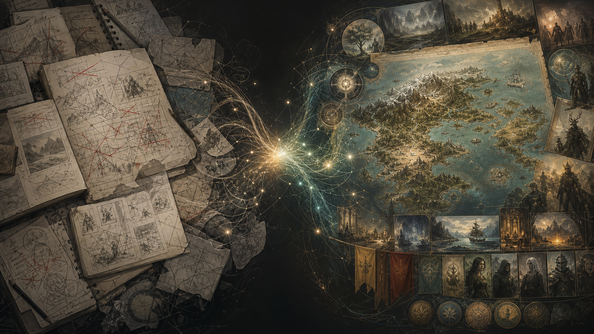

# Building a Universe

Some universes feel discovered. Others feel invented. And the difference is massive.

In Star Wars A New Hope, the Clone Wars gets a passing mention. Kenobi's past exists in fragments. The Empire's reach extends to systems we never visit. The galaxy stretches far beyond what's on screen. Middle-earth is the same. And Arrakis. We feel these universes, their size and life all because of one key pattern.

The world existed before the story.

- **Tolkien** spent roughly 40 years developing Elvish languages and mythology before The Fellowship of the Ring reached publication in 1954.
- **Herbert** read over 200 books on desert ecology after a 1957 trip to the Oregon dunes, then spent six years building Arrakis before Dune was serialized.
- **Lucas** filled notebooks with the history of the Jedi, the Sith, the fall of the Republic, and the political dynamics of a galaxy audiences would only glimpse on screen.

Each built their universe. Explored and created their own world. Populated with characters filled with history, culture and soul. Before finally zooming into just one place, one time and one story. All to share the world they'd built with the rest of us. This is what makes them great!

World-first storytelling took a lifetime. And shortcutting the process led to absolute disasters...

- Rey has powerful Jedi skills with no training or effort
- Palpatine returns with no foreshadowing
- Snoke is built up and discarded
- The First Order is the Empire with a fresh coat of paint

and a lifetime of scribbling in notebooks is wasted.

 

Could AI be the solution?

LLMs are amazing co-creators. Able to build a universe with you in days, not years. Geography. History. Political systems. Factions. Cultures. Characters with their own behavioural traits and goals, all rooted in a world's own logic.

What used to take years can happen in an afternoon. Any writer can sit down and create a universe. Any hobbyist with a world rattling around in their head can finally get it out. Writers can check for plot holes, continuity errors and ideate over and over.

Think you can build a better galaxy far, far away?

Give it a try...
No one needs to see it.
You don't have to create a story or movie franchise from it.
Creation is the only goal.
And I promise, it's a lot of fun rebuilding the galaxy.
